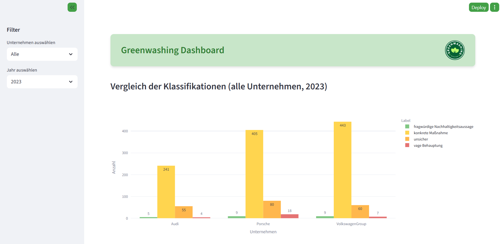

# Greenwashing Detector

## Projektübersicht

Der Greenwashing Detector ist ein datengetriebenes Analyse-Tool, das Nachhaltigkeitsversprechen von Unternehmen der Automobilbranche systematisch untersucht. Ziel ist es, Transparenz über die tatsächliche Umsetzung und Glaubwürdigkeit von Nachhaltigkeitsmaßnahmen zu schaffen und potenzielles Greenwashing aufzudecken.

Das Projekt kombiniert modernste KI-Technologien mit umfassender Textanalyse, um Nachhaltigkeitsberichte und weitere Unternehmensdokumente auf relevante Versprechen zu durchleuchten, diese zu klassifizieren und mit externen unabhängigen Quellen abzugleichen.

## Vorgehensweise

Das Projekt nutzt zwei Ansätze:

1. Extraktion und Analyse von Nachhaltigkeitsversprechen
    - Einsatz eines Large Language Models (LLM), um aus PDFs mit Nachhaltigkeitsberichten alle konkreten Nachhaltigkeitsversprechen zu extrahieren.
    - Sorgfältige Textvorverarbeitung (Reinigung, Satzsegmentierung, Chunking), um die Qualität der Modellinputs sicherzustellen.
    - Deduplizierung und neutrale Umformulierung der extrahierten Versprechen.

2. Bewertung und Klassifikation der Versprechen
    - Anwendung eines BERT-basierten Zero-Shot-Classifier-Modells zur Einordnung der Aussagen in Kategorien wie „konkrete Maßnahme“, „vage Behauptung“ oder „fragwürdige Nachhaltigkeitsaussage“.
    - Zusätzlich wird eine kritische Überprüfung der Erfüllung der Versprechen anhand unabhängiger, externer Quellen vorgenommen. Dabei werden der aktuelle Status, Realisierbarkeit und eine Ampelbewertung (grün/gelb/rot) vergeben.

## Ergebnispräsentation
Die gewonnenen Ergebnisse werden in einem interaktiven Dashboard visualisiert, das mit Streamlit umgesetzt wurde. Nutzer können Unternehmen und Jahr filtern, um Vergleichsdiagramme und Bewertungen einzusehen. Das Dashboard zeigt KPI-Verteilungen als Kreis- und Balkendiagramme sowie eine interaktive Exploration der einzelnen Aussagen basierend auf deren Sicherheits-Score. Zudem sind eine Score-Verteilung und der Export der gefilterten Daten als CSV-Datei möglich.

# Voraussetzungen und Installation
Um das Projekt lokal auszuführen, empfiehlt es sich, eine virtuelle Umgebung zu erstellen: python -m venv venv
Aktiviere (source venv/bin/activate on WSL/Linux) die virtuelle Umgebung. Unter Windows mit der PowerShell:
.\venv\Scripts\Activate.ps1
oder mit dem Command Prompt:
.\venv\Scripts\activate.bat
Installiere alle Requirements (pip install -r requirements.txt).

# Nutzung des Dashbaords
Das Dashboard kann durch folgenden Befehl gestartet werden: streamlit run greenwashing_dashboard.py
Dadurch wird eine lokale Webanwendung geöffnet, in der die Analyseergebnisse interaktiv erkundet werden können.

# Methodischer Hintergrund
Bei der Entwicklung des Greenwashing-Detektors wurde der CRISP-DM-Prozess (Cross Industry Standard Process for Data Mining) angewendet. Dieser strukturierte Ansatz gewährleistet eine systematische und nachvollziehbare Umsetzung der Datenanalyse von der Problemdefinition bis zur Präsentation der Ergebnisse.